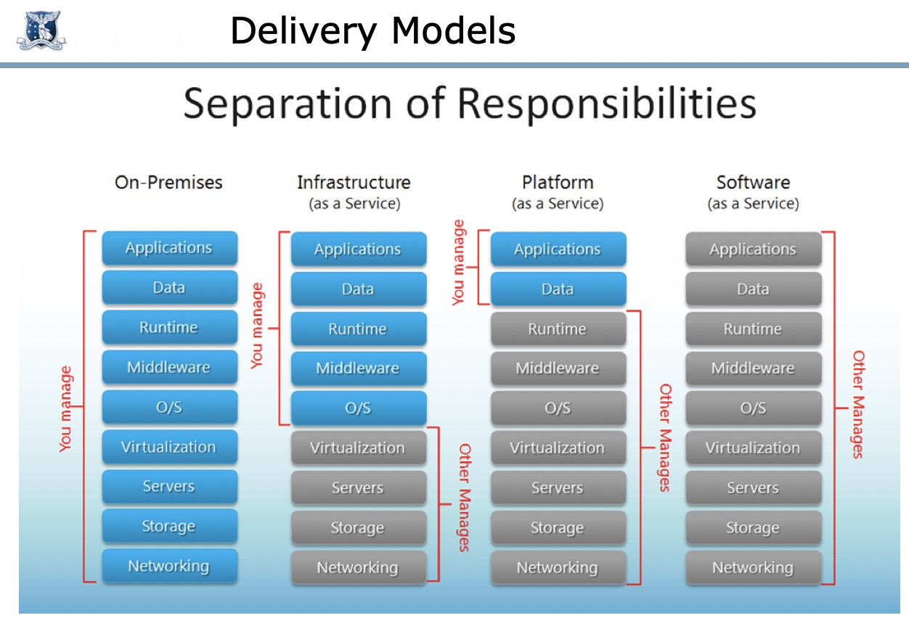

## Cloud Computing

### The Most Common Cloud Models
  
- Deployment Models
  - Private
    - Control, secure, consolidation of resources
    - Utility challange, management overhead(超支)

  - Public
    - Utility computing, Can focus on core business, cost-effective
    - Security proble, loss of control, possible lock-in
  
  - Hybrid
    - use privae cloud, but burst into public cloud when needed
    - how to move data?, how to decide which data to be public?

- Delivery(交付) Models
  - Software as a Service (SaaS)
    - Gmail, office 365...
  - Platform as a Service (PaaS)
    - Google App Engine, Amazon Elastic MapReduce
  - Infrastructure(底部结构) as a Service (IaaS) (primary focus of this course)
    - AWS, Orical Public Cloud, Nectar...  

